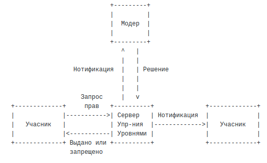

### Вступление

Во время конференции, приложения нуждаются в управлении доступом к ресурсам,таким как права на отправку медиа данных. 

Любой **Протоколам управления уровнями** должен соответствовать требованиям изложенным в RFC4376 [3]. **Бинарный протокол управления уровнями** (BFCP) который описан в данной статье - отвечает этим требованиям.

BFCP был спроектированием с олядкой на мобильные устройства и возможность работать в среде с плохим соединением. Достигнуто это путём использования бинарного кодирования каждого соощения. Что также позитивно сказывается на времени доставки сообщений.

### Терминология

 - **Медиа учасник** - (Media Participant) Сущность которая имеет доступ к медиа ресурсам (например может получать медиа стрим). В конференциях с управлением доступом, каждый медиа учасник обычно сопряжен с **Учасником** (Floor Participant), но это не обязательно. Любой запрос прав (Floor request) заключается в том что-бы *Учасник* запрашивал доступ у *Медиа учасника* когда они не сопряжены. Протокол между *Медиа Учасником* и *Учаником* здесь не описан.
 - **Клиент** - *Учасник* или *Модератор* которые общаются с *Сервером управления правами* используя BFCP.
 - **Модератор**  - (Floor Chair) Сущность которая управляет одним уровнем. Выдает, запрещяет, анулирует разрешения. Будучи модератором для одной транзакции, может являться чем-то другим (например Учасником) для другой транзакции. 
 - **Управление Правами** - (Floor Control) это механизм который позволяет приложениям или пользователям получать безопасный эксклюзивный или не эксклюзивный доступ к ресурсам.
 - **Права** - (Floor) Разрешение на временный доступ или манипулирование общим каким-либо ресурсом или набором ресурсов.
 - **Сервер управления уровнями** - (Floor Control Server) Логическая единица которая поддерживает состояния прав: наличие прав, кто *Модератор* каких прав, и т.д. Запросы на управление правами направляются на *Сервер управления уровнями*. *Сервер управления уровнями* в одной конферении, может выполнять другую роль (например *Учасника*) в другой конференции.
 - **Учасник** - (Floor Participant) Сущность которая запрашивает права у *Сервера управления уровнями*. Может быть *Учасником* в оной транзакции и чем-то другим (например *Модератором*) в другой транзакции.  

### Цель

Как упоминалось выше, BFCP - это протокол для управления доступом к ресурсам в конференции, который отвечает требованиям изложенным в [3]. BFCP определенный в данном документе лишь предоставляет средства для управления правами доступа. Правила и ограничения для управления правами и результатами присвоения прав здесь не описаны и находятся в других документах.

Рисунок 1 показывает задачи которые выполняет BFCP:

 
BFCP предоставляет средства:
 * для учасников: отправка запросов к серверам управения правамию
 * для серверов: выдавать или запрещать запросы на доступ к определенному ресору от учасников
 * для модераторов: отправлять серверам решения относитено запросов на права доступа.
 * для серверов: информировать учасников и модераторов о статусе определенного права доступа или запроса.
 
Существуют также задачи, напрямую не относящеся к BFCP но которые играют важную роль в создании прав доступа и установлении соединений между объектами. Ниже будут рассмотрены некоторые из них.

### Создание права доступа
Взаимосвязь определенного права доступа с ресурсом или набором ресурсов (например медиа стримы) выходит за рамки BFCP. Создание и удаление права доступа также не входит в BFCP. Эти понятия обрабатываются с помощью Протокола Управления Конференцией (conference control protocol) для менеджирования объектами конференции. Поэтому, Сервер Управления Правами должен всегда быть осведомлен обо всех состояниях/изменениях объектов (Например знать когда создается новое право доступа).

### Получение информации для подключения к Серверу Управления Правами
Клиент нуждается в наборе контактных данных чтобы установаить BFCP соединение с Сервером Управления Правами. Эти данные включают адресс сервера, идентификатор конференции и идентификатор учасника. Клиенты могут получить эту информацию разными путями: используя обмен SDP файлами [4] или другим способом который описано библиотекой XCON.

### Определение связей между Правом доступа и Ресурсом

Права ассоциированы с ресурсами. Например, право которое контролирует кто говорит в определенныйй момент времени имеет аудио сессия как ассоциированный ресурс. Связь между правом и ресурсом является частю объекта конференции. Учасники и модераторы долны знать какие ресурсы вссоциированны с какими правами. Они могут получить эту информацию используя разные механизы, например с помощью обмена SDP оффер/ответ. Как использовать єтот механизм описано в [4].

 
 ### Особенности протокола BFCP
  - Бинарный
  - TSV (Type Size Value)
  - Быстрый

### Литература
- [1] https://pdfs.semanticscholar.org/aaba/fcfb9b9a5c8bd91355fc2743157a002e4cfc.pdf
- [2] https://tools.ietf.org/html/rfc4582
- [3] https://tools.ietf.org/html/rfc4376
- [4] https://tools.ietf.org/html/rfc4583
