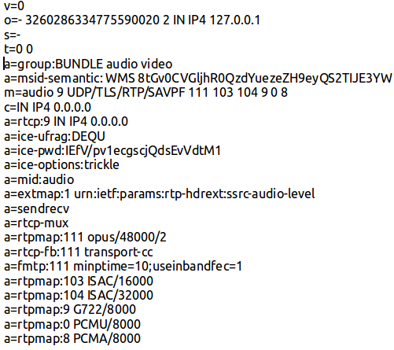
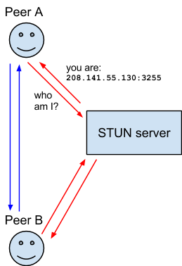

### Знакомство с WebRTC

#### Появление WebRTC

Привлекательность информации в интернете сделала своё дело: на сегодняшний день веб-браузер занял основное место на рабочем столе ноутбука.  С годами он из простого интерпретатора превратился в мощный инструмент который позволяет решить практически любые задачи. А с распространением мобильных девайсов, его присутсвие в нашей повседнейвной жизни только увеличилось. Сегодня мы можем совершать видео-звонки прямо из окна браузера. Давайте вернемся на 10 лет назад и посмотрим как это зарождалось.

##### Поглощение On2
В 2009 году существовала компания On2 Technologies. На тот момент она была на рынке уже 19 лет и занималась разработкой видео кодеков для игр. На заре своего существования, в начале 90-х они отличались от тогдашнего MPEG тем что могли декодировать видео в реальном времени не прибегая к использованию дополнительных процессоров. Их кодеки использовались в игровых консолях.

Постепенно они перешли и на десктопы: Mac и Windows. Первые версии кодеков для них были выпущены в 1996 году. Тогда они уже позволяли захватывать видео и кодировать в реальном времени. 

В 2001 году компания выпустила новую версию кодека "VP3" и сделала его open-source. Постепенно улучшая алгоритмы и оптимизируя его под современные процессоры, к 2008 году у них уже был кодек VP8. На котором для них все и закончилось (хорошо).

Закончилось хорошо, потому что 7-го января 2010 года, совет директоров компании согласился принять пердложение о поглощении компанией Google. Сумма сделки - $124 млн. Целью данного поглощения было найти альтернативу видео-кодеку h.264 и при этом не платить роялти.

##### Поглощение GIPS (Global IP Solution)

Google на этом не остановилась. Ведь для полной картины им не хватало собственного аудио-кодека. Их выбор остановился на компании Global IP Solution. Эта компания была извесна тем что до 2007 года её аудио-кодек iSAC (internet Speech Audio Codec) использовался в Skype. Также Компания GIPS имела наработки в сфере VoIP которые подходили под задачи Google. Сумма сделки $68 млн.

Все скупленное Google сделала opensource.

Теперь у компании были в наличии все технологии необходимые для совершения видео-звонков:
1. Видео кодек VP8
2. Аудио кодек iSAC
3. Протокол передачи контрольных сообщений был бесплатный (SIP)
4. Протокол передачи медиа данных тоже бесплатный(RTP)

Теперь за дело взялись инженеры Google. Идея была создать API который мог бы легко использоваться в приложениях для совершения видео-звонков. Естетсвенно, нужен был яркий пример как использовать это API. Им стал Hangouts, который был выпущен в июле 2014-го года.


#### Уникальность WebRTC

Появившись на свет, WebRTC должен был быть лучше существующих решений для видео-звонков, давайте рассмотрим главные отличия от конкурентов на момент выхода на рынок:
1. Нет жестких требований к протоколу клиент-сервер (для передачи контрольных сообщение можно использовать даже чат)
2. Бесплатные кодеки для видео (VP8) и аудио (G.711, iSAC)
3. Простой API и поддержка в набиравшем популярность Chrome. 

Все это было нацелено на аудиторию web-разработчиков. Они могли с легкостью использовать WebRTC не вникая в подробности реализации самой технологии. 
Но WebRC - это не только браузер. На сегодняшний день мы можем использовать эту технологию на любой платформе где можно скомпилировать С++ код. Ведь в основе лежат всё те же RTP для медиа данных и WebSocket (в большинстве случаев) для сигналинга. 

#### Основные компоненты WebRTC

На поверхности лежит JavaScript API. Она состоит оз 4 основных модулей:
1.  **getUserMedia** - позволяет работать с устройствами захвата видео/аудио. Дает возможность их настраивать и переключатся между ними. 
2. **RTCPeerConnection** - самый основной компонент. Включает в себя логику по сигналингу и передаче медиа данных. Сюда входит: кодирование, энкриптирование, контроль пропускной способности и много другое.
3. **RTCDataChannel** - Вспомогательный компонент для передачи данных отличных от видео/аудио потоков. Это могут быть файлы или чтото вроде чата.
4. **getStats** - Очень мощный инструмент для получения информации о текущих стримах. Часто используется для отладки приложений или чтобы собирать статистику для аналитики.

Все выгладит довольно просто снаружи, давайте теперь заглянем внутрь API. Внутри у нас гигабайты С++ кода, разбитого на модули. Расмотрим основные из них:


##### Your Web App
Так как изначально WebRTC задумывался как удобный инструмент разработки видео-звонков внутри браузера, то естественно оргомное внимание уделено WebAPI. Оно используется Web-приложениями. Они на вершине данной схемы.

##### Web API
Включает в себя все модули WebRTC и скрывает довольно сложную архитекруту, чтобы разработчики сконцентрировались исключительно на бизнес логике своих приложений и делали этот Мир лучше. ;)

##### WebRTC Native C++ API**
Дальше идет уровень API которым пользуються разработчики браузеров для реализации собственных WebAPI. Также этот уровень API используется программистами для создания WebRTC медиа серверов. Или например WebRTC клиентов для нативных мобильных приложений, или десткоп-приложений на разных платформах. Иными словами, это точнка входа для не web-программистов. ;)

Рассмотрим основные компоненты WebRTC. Все они open-source и все уже прошли проверку временем еще до включения их в состав WebRTC:

##### Session Management
Абстрактный уровень, который отвечает за установку соединения (сигналинг). Протокол может быть разный, способ доставки служебных сообщений внутри этого протокола тоже может быть какой угодно. Обычно используют WebSocket.

##### Transport / Session
Траспортный модуль для осуществления передачи медиа данных заимствовани у библиотеки *libjingle*. Это аналог xmpp/jingle протокола который используется в приложениях для обмена сообщениями с 1999 года. Его можно разбить н а3 основных компонента:

1. **SRTP Stack** - Используется для передачи медиа данных. Транспортный уровень при этом - *UDP*. Одна из главных преимуществ WebRTC - это секюрность. И она уже включена в протоколы передачи данных. Также используется протокол *RTCP* для передачи контрольных пакетов.

2. **Multiplexing** - модуль который объеденяет аудио и видео потоки (Bundle) и/или RTP пакеты с RTCP пакетами (rtcp-mux). Это позволяет сэкономить ресурсы на открытие UDP портов. А в случае с серверами - позволит обслуживать больше клиентов одновременно.

3. **STUN/TURN/ICE** - Модуль который позволяет использовать STUN и ICE механизмы для установления соединения сквозь разные типы фаерволлов.

##### Voice Engine

Набор модулей которые отвечают за доставку аудио данных от источников звука до сети. Основными из них являются:

1. **iSAC / iLBC / Opus** - Как мы уже рассматривали, WebRTC включает в себя набор аудио-кодеков. Часть из них пришла с поглощение мкомпании On2. К ним добавился популярный на сегодняшний день *opus*. Opus является open-source продуктом в реультате совместной работы инженеров из разных компаний. Активное участие в разработке принимали нженеры Skype.

2. **NetQE for voice** - модуль для поддержания максимально низкой буферизации аудио-данных при плохих условиях соединений. Также здесь происходит устранение неприятных аудио-эффектов при потере пакетов.

3. **Acoustic Echo Canceler (AEC)** - программные алгоритмы для устранения эффекта эхо, когда в микрофон попадают сказанные слова вернувшиеся от собеседника. Например когда вы общаетесь без наушников с помощью ноутбука.

4. **Noise Reduction (NR)** - модуль который определяет посторонние шумы и удаляет их их адуио сигнала. В результате собеседник слышит более чистый звук.

##### Voice Engine

Набор модулей ля доставки видео сигнала из источников видео (камера, экран) до сети.

1. **VP8/VP9/h.264** - На сегодняшний день широко используются эти кодеки. VP9 только выходит на арену, и еще не все устройства его поддерживают. WebRTC позволяет выбрать любой из них, но тут нужно учитывать конкретные задачи и целевую аудиторию. Некоторые устройства имеют аппаратную поддержку h.264, некоторые - VP8. WebRTC дает возможность разработчикам самим выбирать приоритные кодеки. А конкретный кодек для сессии выбирается на этапе сигналинга, но об этом чуть позже.

2. **Video Jitter Buffer** - буфер видео-данных для сглаживания потерь при передече данных. В результате пользователь получает более приятную картинку с минимальной задержкой относительно источника.

3. **Image enhancements** - сюда можно отнести полезные фишки обработки видео, например очистка от шумовб и т.д.

#### Как это работает

Для того чтобы увидеть вживую как работает WebRTC, достаточно зайти на сайт appr.tc и войти в одну и ту же комнату из 2 устройств с браузером Chrome. 

Google любезно предоставляет нам свои сервера для соединений двух пиров для видеочата. А все потому что ресурсов для соединения двух пиров требуется совсем ничего. Всё что должен сделать сервер - это переслать пару сообщений между клиентами.

Давайте разберемся что же происходит за те 2 секунды которые проходят после нажатия на кнопку *Connect*.

Процесс установки соединения условно можно разделить на 3 этапа:
1. Два клиента должны найти друг друга.
2. Договориться что и кудой передавать между пирами.
3. Начать передавать медиа данные.

##### Найти друг друга
Первая задача с которой сталкиваютсяь клиент при совершении звонка это как найти того кому нужно позвонить. Вариантов решений может быть много и у каждого свои преимущества и недостатки. Поэтому компания Google не стала ограничивать нас выбором какого-то одного решения. 

Обычно для этих целей используют *Signaling Server*. Он используется в качестве места куда обращаются клиенты в поисках своих абонентов. Он должен быть доступным для клиентов которых вы хотите связать видео-звонком. Грубо говоря, всё что он делает - это перенаправляет пару текстовых сообщений между клиентами для установления связи. То есть, как простую альтернативу можно использовать любой общедоступный ресурс который умеет передавать текстовые сообщения. Например, Facebook Messenger вполне подойдет :)

В показанном ранее примере с appr.tc мы использовали сервер Google для доставки сообщений между клиентами для установления соединения. Чтобы отделить тысячи одновременно звонящих клиентов мы вводим код комнаты. Два клиента попавших в одну комнату начинают звонок между собой. В данном случае нам нужно передать только код комнаты тому с которым мы хотим связаться. Как только соединение установлено, сервер больше не нужен, дальше клиенты общаются сами.

Теперь давайте расмотрим что же это за сообщения которые нужно передать между клиентами.

##### Договориться что и кудой передавать между пирами

Итак, пока у нас есть посредник который передает текстовые сообщения, клиенты должны успеть договорится о формате передачи данных и о пути кудой его передавать.

###### Формат
На сегодняшний день существует множество аудио и видео кодеков а также разных цветовых пространств видео кадров. Задача состоит в том чтобы принимающая сторона знала и понимала формат видео и аудио данных который ей приходит от отправителя. Задача усложняется тем что не все клиенты поддерживают тот или иной формат или кодек, то есть нужно найти тот который подходит обеим сторонам.

Тут никто велосипед не выдумывал и было решено использовать SDP (Session Description Protocol). Сообщение SDP которое передается между клиентами может включать иснормацию о формате, кодеке, протоколе передачи данных, порты которые будут использоваться (но не всегда). Это сообщение может содержать сотни строк с разными параметрами. Есть обязательные параметры и желательные. Есть такие которые поддерживаются всеми пользователями, есть такие которые известны только webRTC библиотекам. Звучит сложно но основная идея это описать ЧТО будет передаваться от отправителя к получателю.


SDP файл передается по каналу связи через сигналинг сервер, обычно используя secure web socket. Оба клиента шлют свои SDP. Инициатор звонка шлет его в сообщении под названием *Offer*. В этом SDP инициатор описывает все форматы и кодеки которые он может послать или принять. Принимающая сторона получает его, анализирует, меняет (обычно удаляет те кодеки которые ей не подходят) и отправляет назад в сообщении под названием *Answer*. В итоге после 2 сообщений каждая из сторон знает "общий знаменатель" - формат который подходит обеим. Если же такого общено нет - соединение не состоится. Разве что вы используете комерческий продукт который сможет стать посредником и транскодировать медиа данные пропуская их через себя. Но это уже совсем другая история :)

Давайте посмотрим на класический SDP файл который шлет Chrome выступая клиентом-инициатором видео звонка:



Данный пример содержит приверно 30% от того что содержится в реальном SDP файле. Я упростил для наглядности и чтобы влезло в один слайд :). Давайте рассмотрим каждою строчку и что она означает:
 - **v=** - версия протокола, сейчас она всегда 0.
 - **o=** - здесь несколько значений разделенных пробелом, означают соответсвенно: ID сессии, версия сессии, тип сети, тип IP адресации, локальный адрес.
 - **s=** - текстовое имя сессии, обычно не сипользуется
 - **t=** - устанавливается начально и конечное время сессии. Если стоят нули, то ограничения по времени нет.
 - **a=group** - a - означает атрибут, в данном случает от устанавливает атрибут *group* в занчение *BUNDLE audio video*. Это одначает что адуио и видео данные могут быть сгрупированы в одну RTP сессию. Могут, потомучто приемная сторона тоже должна это подтвердить.
 - **a=msid-semantic** - устанавливает уникальную ID для видео и аудио медис стримов (так как находится в шапке SDP). этот идентификатор будет передаваться в хидере RTP пакетов указвая к какой WebRTC сессии относится конкетный медиа-стрим.
 - **m=audio** - отсюда начинается секция настроек аудио стрима. Конкретно эта строчка описывает тип меда данных (*audio*), дальше следует идентификатор *9* (о нем чуть позже), дальше описывается протокол по которому будут идти данные (*UDP/TLS/RTP/SAVPF*). Потом указаны коды форматов через пробел, каждый код ожначает отдельный формат, они все описаны ниже.
 - **с=IN** - здесь указывается внешний IP адрес на который будут приходить данные (и отсылатся из него). В WebRTC это значени не используется, поэтому не пугайтесь этих нулей.
 - **a=rtcp** - описывает кудой будут ходить контрольные пакеты протокола RTCP. Здесь снова *9* и нули. Детали чуть позже.
 - **a=ice-...** - это атрибуты которые нужны для обмена ice-кандидатами между клиентами. 
 - **a=mid** - здесь указывается идентификатор который раньше был указан в BUNDLE. Если бы здесь было несколько аудио потоков то нужно было бы их назвать по разному.
 - **a=extmap** - здесь указывается что в хидер RTP пакетов будут жополнительные данные. В этом случае - информация об уровне аудио.
 - **a=sendrecv** - означает что данная сессия будет принимать и отправлять видео. Также может быть *sendonly* или *recvonly*.
 - **a=rtcp-mux** - щзначает что данный клиент поддерживает мультиплексирование RTP и RTCP пакетов. Если другая сторона это тоже поддерживает то так и будет.
 - **a=rtpmap** - это уже описание конкретного формата по идентификатору который идет сразу после двоеточия (111, 103, 104...). Здесь детально описываются кодеки которые поддерживаются клиентом.
 
 Итак, мы рассмотрели самые основные атрибуты SDP которые используются в WebRTC. Данный файл полностью описывает возможности каждого клиента. Клиент имея в наличии свою и удаленную SDP может точно определить какой формат будет использован при передаче видео и адуио данных. На вопрос ЧТО передавать клиенты уже знают ответ. Теперь нужно узнать КАК передавать ? Ведь все атрибуты с указанием адресов и портов были пусты. Очевидно что для определения адресов используется что-то другое. Это ICE техника.
 
##### Ice техника

ICE (Interactive Connectivity Establishment) - это техника которая позволяет соединить двух клиентов напрямую по самому оптимальному маршруту. Как извесно, клиенты обычно не имеют публичного IP-адреса и находятся за  NATом. Задача ICE пройти NAT и установить соединения между клиентами. И если это не удасться - использовать сервер посредник TURN.

Давайте рассмотрим ситуацию когда клиент А хочет напрямую связатся с клиентом Б. Они находятся в разных странах, оба за NATом. 

Первым в игру вступает *STUN* (Session Traversal Utilities for NAT) сервер. Его задача проста: узнать откуда приходят запросы и рассказать об этом тому кто спрашивает. Таким образом клиенты узнают свои внешние адреса по которым они доступны извне. 



Дальше клиенты формируют несколько *ice-candidate*. Почему несколько ? Потому что каждый имеет как минимум локальный сетевой интерфес, также внутренний IP адрес (а вдруг они в одной локальной сети ?) и если сетевых интерфейсов много, то для каждого свой ice-candidate. Кандидаты могут быть 3 типов: 
 - *host* - такие которые содержат адреса локальных сетевых интерфейсов
 - *srflx* - полученные путем обращения к STUN серверу.
 - *relay* - особая категория кандидатов. Получаются путем обращения к *TURN* серверу.

Вот пример одного ice-candidate:

```candidate:717511287 1 udp 1685921535 5.1.14.254 51246 typ srflx raddr 192.168.1.172 rport 51246```

Он состоит из:
 - *Уникального ID* - он уникальный для пары кандидатов для RTP и RTCP
 - *ID компонента* - их всего 2 (1 - RTP, 2 - RTCP)
 - *Транспорт* - udp или tcp
 - *Приоритет* - для локальных и рефлексийных кандидатов он выше
 - *Адресс и порт*
 - *Тип кандидата* - описано выше
 - *Относительный адрес* - опционально, для рефлексийных кандидатов это адрес хоста, для релейных - промежуточный сервер.

Теперь кандидаты нужно передать другому клиенту чтобы он узнал как к вам обратится напрямую. Для переачи ice-candidate используется тот же канал связи что и для SDP. 

Как только клиенты получают ice-candidate от другого клиента, они начинают "проверять" их: отсылать тестовые пакеты и смотреть доставлены ли они. Процесс проверки кандидатов довольно сложный, пока его не будем подробно рассматривать. 

После проверки, определяется пара кандидатов которая связывает двух клиентов напрямую по опитимальному маршруту. В крайнем случае будет использоваться *TURN* сервер. Статистика показывает что *TURN* сервер применяться примерно в 10% случаев. Это случается когда оба клиента оказываются за симметричным NATом.

Весь выше описанный процесс занимает 1-2 секунды. Как только соединение установилось, медиа-данные начинают передаваться. То есть времени ушло не больше чем длина пары гудков в телефоне. Это действительно круто!

#### Оптимизация передачи данных

WebRTC умеет не только очень быстро связывать двух клиентов, он также умеет очень грамотно использовать имеющиеся сетевые ресурсы. При чем делает она это используя несколько техник. Каждая из них заслуживает отдельного рассмотрения, мы же вкратце ознакомимся с самой важной из них: *Adaptive bitrate*. Так как WebRTC контролирует процесс энкодинга и процесс передачи данных по сети, то он также может реализовать передачу данных с контролем качества на приемной стороне. Это достигается путем использования двух протоколов: SRTP для передачи данных и SRTCP для передачи статистики от принимающей стороны. На основе этой статистики сторона-отправитель может коректировать количество отправляемых данных. Имея контроль над энкодером, можно менять битрейт, кадры в секунду, размер. Таким образом WEbRTC может работать при очень узком канале связи, сохраняя при этом адекватную картинку. С другой стороны, имея широкий канал связи WebRTC автоматически поднимет качество видео вплоть до HD. 

#### Защищенность

Обязательной фишкой любого комерческого приложения является конфиденциальность. Особенно это актуально для приложений которые пересылают данные по сети. В этом плане WebRTC радует разработчиков тем что всю рутинную работу по защищенности он берет на себя. Она уже заложена в архитекруту этой технологии. Давайте рассмотрим протоколы передачи данных на рахных уровнях для того чтобы убедится в полной защищенности данных:

[protocols](!pictures/protocols.svg)

Начнем с протоколов для передачи контрольных данных. Как уже говориось выше, можно использовать любой канал связи для сигналинга. В большинстве случаев это XHR, SSE или Web Socket. Все они используют HTTP. Который в свою очередь использует TLS на уровне сессии. Завершает картину TCP для полного контроля отправленых пакетов, ведь в сигналинге важно чтобы все пакеты были доставлены.

Для передачи медиа данных инженерам Google пришлось здорово поработать. Перед ними стояла задача совместить преимущества скорости протокола RTP через UDP и секюрности TLS через TCP. Они решили взять RTP, только каждый пакет энкриптировать специальным ключем - получился SRTP. Ключами клиенты обмениваются в начале сессии по протоколу DTLS - это тот же TLS только с минимальными изменениями, которые позволили ему работать через UDP. Таки образом, злоумышленник, получив пакет RTP, не сможет его декриптировать и посмотреть что там. SCTP используется для передачи данных отличных от медиа. Здесь тоже данные энкриптируются перд отправкой. К тому же они тунелизированы DTLSом - получается двойная защита.

#### Статистика

Разработчики WebRTC позаботились о нас - они нам предоставили прекрасный инструмент для анализа и отлаживания приложений. Это статистика PeerConnection. API позволяет получить исчерпывающую информацию о входящих и исходящих стримах. К тому же Chrome имеет встроенный инструмент для простомтра этой статистики. Чтобы ним воспользоваться, достаточно открыть новую вкладку браузера с адресом *chrome://webrtc-internals/*. Давайте посмотрим на графики которые рисует этот инструмент:

[stats](!picures/stats.png)

Это 10я часть того что вы може узнать пользуясь статистикой. Как только вы сталкиваетесь с проблемой передачи данных, первое что нужно сделать - посмотреть статистику, в 90% случаев этого будет достаточно чтобы найти причину проблемы.

### Источники
[1] https://bloggeek.me/webrtc/

[2] https://webrtc.org/architecture/

[3] https://en.wikipedia.org/wiki/Session_Description_Protocol

[4] https://hpbn.co/webrtc/#audio-opus-and-video-vp8-bitrates

[4] https://webrtchacks.com/sdp-anatomy/

[5] https://tools.ietf.org/id/draft-ietf-ice-rfc5245bis-14.html
